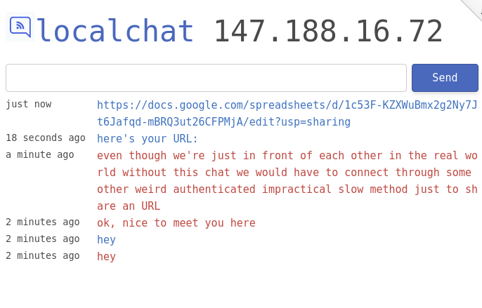

# localchat

Instant web chat rooms (anything under the `/<room>` path goes).
Defaults to your local public IP, which means in most cases people from the same LAN will meet in the default chat.

* **Hosted at:** https://localchat.bigsun.xyz/
* **Run your own:** Install with `go get github.com/fiatjaf/localchat` and run with environment variables `HOST`, `PORT` and (optionally) `REDIS_URL` for caching messages.

